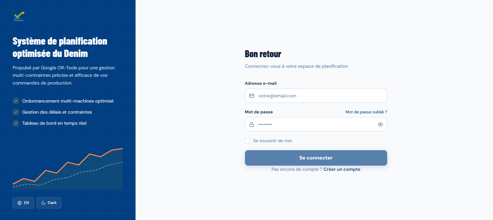
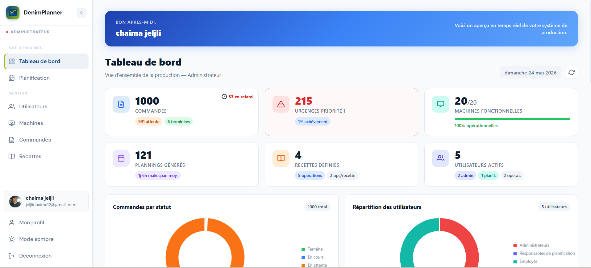
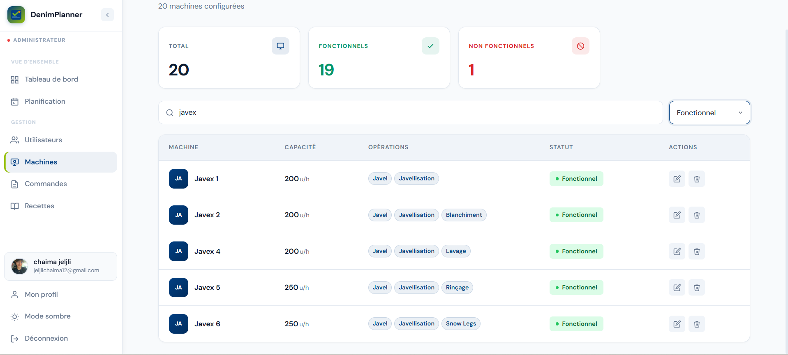
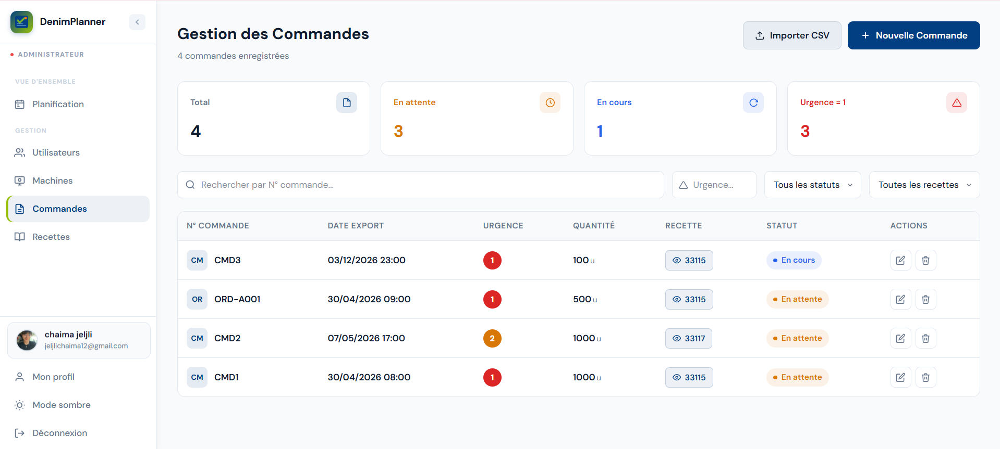
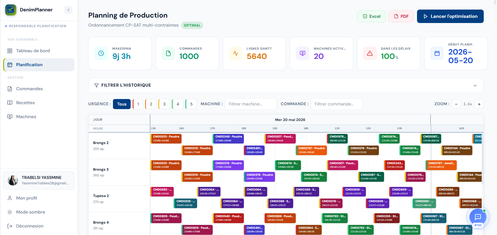
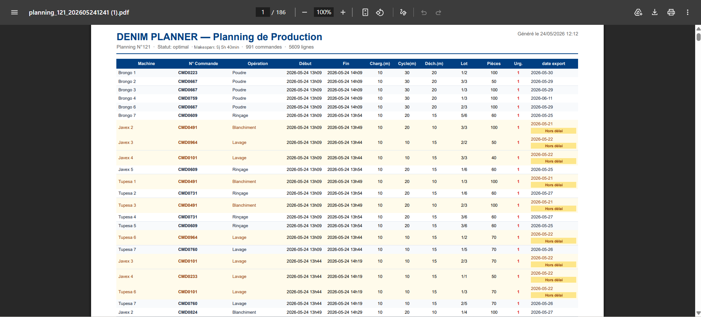
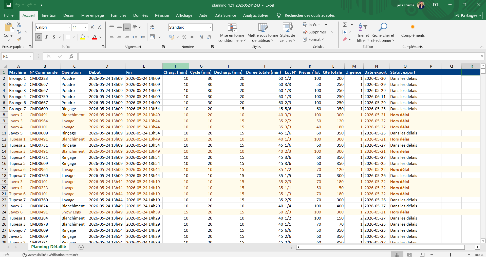
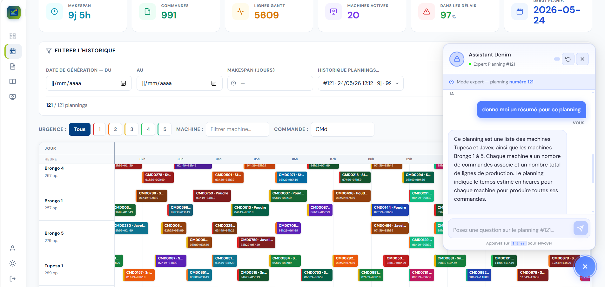

# Projet PFE - Application intelligente de planification 

## Description

Ce projet a été réalisé dans le cadre de mon Projet de Fin d'Études (PFE).

L'objectif est de développer une application intelligente permettant de gérer, planifier et optimiser les processus de production grâce à l'utilisation de techniques avancées d'optimisation et d'Intelligence Artificielle.

## Fonctionnalités

- Gestion des utilisateurs
- Authentification et gestion des autorisations
- Gestion des données du système
- Planification et optimisation des opérations
- Visualisation des résultats de planification
- Export des données
- Assistance intelligente basée sur un LLM

## 📸 Aperçu de l'application

### 🔐 Authentification

### 📊 Tableau de bord

### ⚙️ Gestion des machines et recettes

### 📦 Gestion des commandes

### 📅 Planification optimisée et export

### 🤖 Assistant intelligent

## Technologies utilisées

### Frontend
- Angular
- TypeScript
- HTML5 / CSS3
- Tailwind CSS

### Backend
- .NET
- C#
- API REST

### Base de données
- SQL Server

### Optimisation & Intelligence Artificielle
- Python 
- Google OR-Tools (CP-SAT Solver)
- Métaheuristiques d'optimisation (Large Neighborhood Search - LNS)
- OLLAMA avec le modèle Mistral (LLM)
